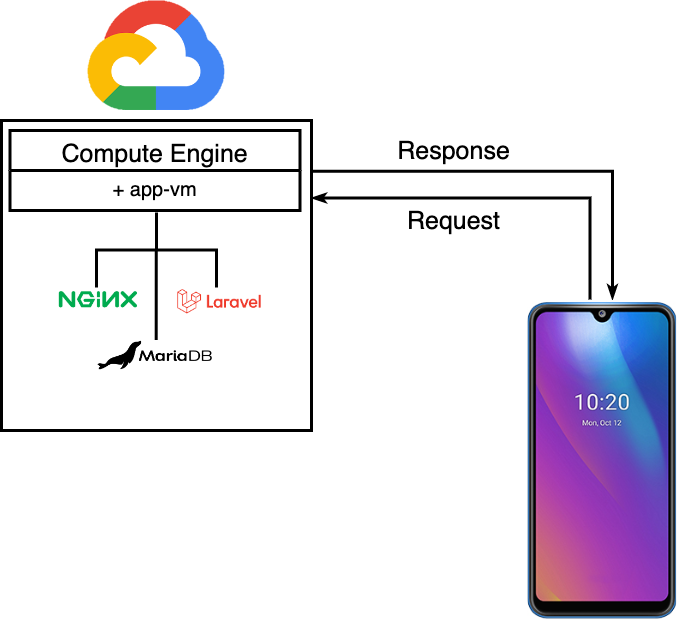
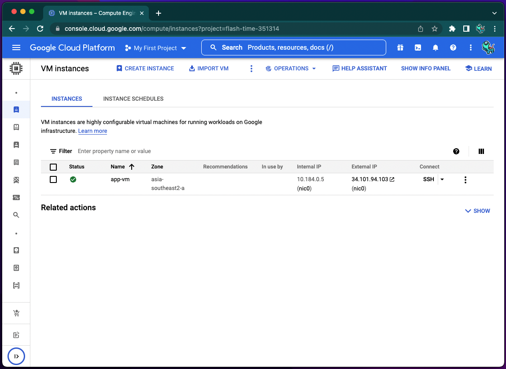
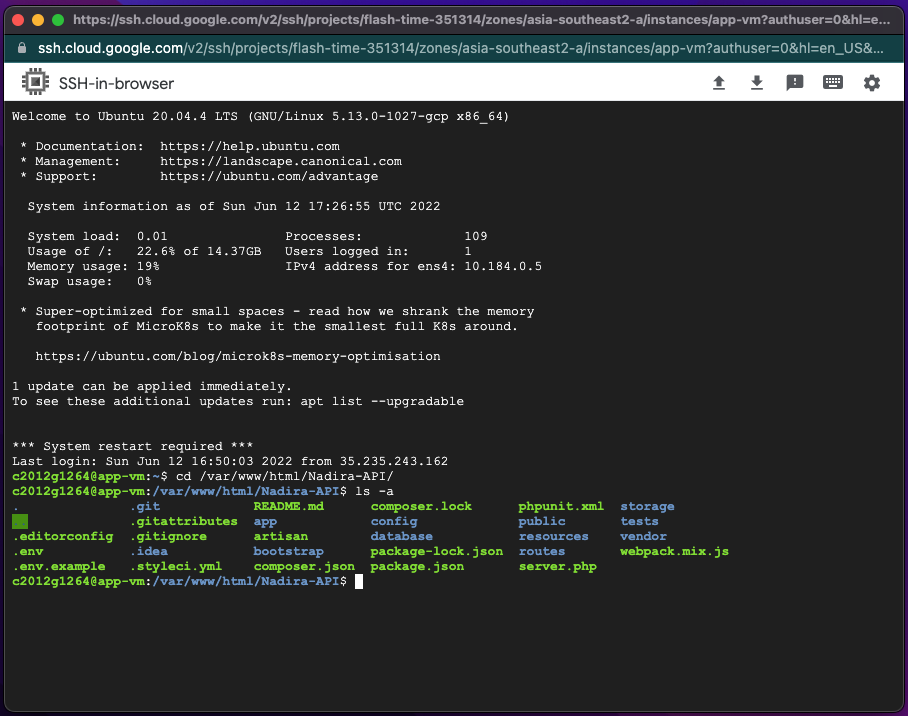

# Cloud Computing  Capstone Project C22-PS345 Bangkit 2022

## Screenshoots

<div>
  <p align="center">
    
    
    
  </p>
</div>

# Deployment Steps
## Create VM, Install Prerequisites, create database

1. Create Google Cloud Platform Project
2. On Compute Engine section, create a VM Instance
5. Open your VM, and clone this git project
6. Install the software dependencies

```sh
$ sudo apt install -y php-mbstring php-xml php-fpm php-zip php-common php-fpm php-cli unzip curl nginx
```

7. Install Composer

```sh
sudo curl -s https://getcomposer.org/installer | php
sudo mv composer.phar /usr/local/bin/composer
```

8. Install MariaDB

```sh
sudo apt install -y mariadb-client mariadb-server
```

9. Start MariaDB

```sh
sudo systemctl enable --now mariadb.service
```

10. Log in to MariaDB as root

```sh
mysql -u root -p
```

11. Create a database named capstonedb and create a database user

```sh
MariaDB [(none)]> CREATE DATABASE `capstonedb` CHARACTER SET utf8 COLLATE utf8_general_ci;
MariaDB [(none)]> CREATE USER 'adminnadira'@'%' IDENTIFIED BY '123456';
```

12. Grant permissions

```sh
MariaDB [(none)]> use laravelexample;
MariaDB [laravelexample]> GRANT ALL ON `capstonedb.*` TO 'adminnadira'@'%';
MariaDB [laravelexample]> FLUSH PRIVILEGES;
MariaDB [laravelexample]> EXIT;
```

## Configure env Laravel and connect to database

1. Make .env

```sh
cd Nadira-API
mv .env.example .env
nano .env
```

2. Configure connection database on .env

```sh
DB_CONNECTION=mysql
DB_HOST=127.0.0.1
DB_PORT=3306
DB_DATABASE=capstonedb
DB_USERNAME=adminnadira
DB_PASSWORD=123456
```

3. move project to directory /var/www/html and grant your non-root user access

```sh
sudo mv ../Nadira-API/ /var/www/html
sudo chmod -R 755 /var/www/html/Nadira-API
sudo chown -R your_username:your_username /var/www/html/Nadira-API
```

4. Install the Nadira project and migrate database

```sh
composer update
composer install
php artisan migrate
php artisan db:seed
```

## Configure Nginx

1. Create an Nginx configuration file

```sh
sudo nano /etc/nginx/sites-available/Nadira-API
```

Copy this configuration and change YOUR_EXTERNAL_IP with external ip VM

```sh
server {
    listen 80;
    server_name YOUR_EXTERNAL_IP;
    root /var/www/html/Nadira-API/public;

    add_header X-Frame-Options "SAMEORIGIN";
    add_header X-XSS-Protection "1; mode=block";
    add_header X-Content-Type-Options "nosniff";

    index index.php;

    charset utf-8;

    location / {
        try_files $uri $uri/ /index.php?$query_string;
    }

    location = /favicon.ico { access_log off; log_not_found off; }
    location = /robots.txt  { access_log off; log_not_found off; }

    error_page 404 /index.php;

    location ~ \.php$ {
        fastcgi_pass unix:/var/run/php/php7.4-fpm.sock;
        fastcgi_param SCRIPT_FILENAME $realpath_root$fastcgi_script_name;
        include fastcgi_params;
    }

    location ~ /\.(?!well-known).* {
        deny all;
    }
}
```

2. Enable the Nginx configuration and remove the default configuration file

```sh
sudo ln -s /etc/nginx/sites-available/Nadira-API /etc/nginx/sites-enabled/
sudo rm /etc/nginx/sites-enabled/Nadira-API
```

3. Restart Nginx

```sh
sudo systemctl restart nginx
```

4. Test your Nadira-API

```sh
http://YOUR_EXTERNAL_IP/
```